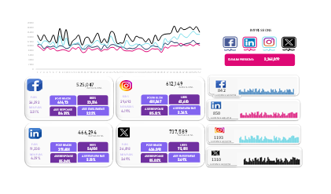

# 📊 Social Media Performance Dashboard



## 📝 Overview  
This dashboard provides a comprehensive analysis of social media performance across **Facebook**, **Instagram**, **LinkedIn**, and **X (formerly Twitter)**. It consolidates critical metrics and trends to help businesses and marketers make data-driven decisions.  

### Key Metrics  
- 📈 **Impressions**: Total number of views across platforms.  
- 💬 **Engagement Rates**: Percentage of audience interactions, including likes, comments, and shares.  
- 🚀 **Audience Growth**: Tracking the increase in followers and audience size.  
- 📊 **Performance Trends**: Line charts visualize platform-specific trends over time.  

By offering both high-level insights and platform-specific breakdowns, the dashboard enables effective tracking and optimization of social media strategies.  

---

## 🔍 Features  
- **Interactive Cards**:  
  Each platform (Facebook, Instagram, LinkedIn, X) has a dedicated card displaying key statistics such as impressions, engagement rates, and growth percentages.  
- **Trend Analysis**:  
  A line chart provides a clear comparison of performance trends across platforms over time.  
- **Comparative Insights**:  
  Highlights strengths and areas for improvement, helping to evaluate which platform is performing best.  
- **X (Twitter) Focus**:  
  Includes metrics specific to Twitter/X, such as tweet performance and follower changes.

---

## 💡 Use Cases  
This dashboard is ideal for:  
1. **Marketers**: To assess the success of campaigns across different platforms.  
2. **Social Media Managers**: To track audience engagement and identify top-performing platforms.  
3. **Business Owners**: To visualize social media ROI and inform resource allocation.  

---

## 🛠 How to Use  
1. Clone this repository to your local system:  
   ```bash
   git clone https://github.com/yourusername/social-media-dashboard.git
